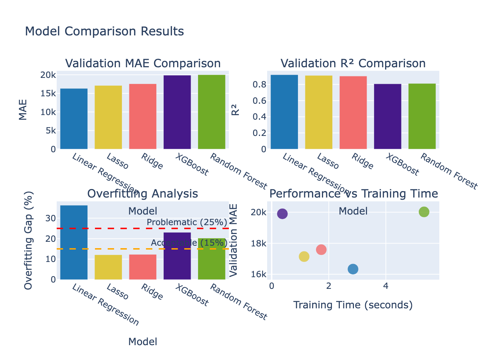
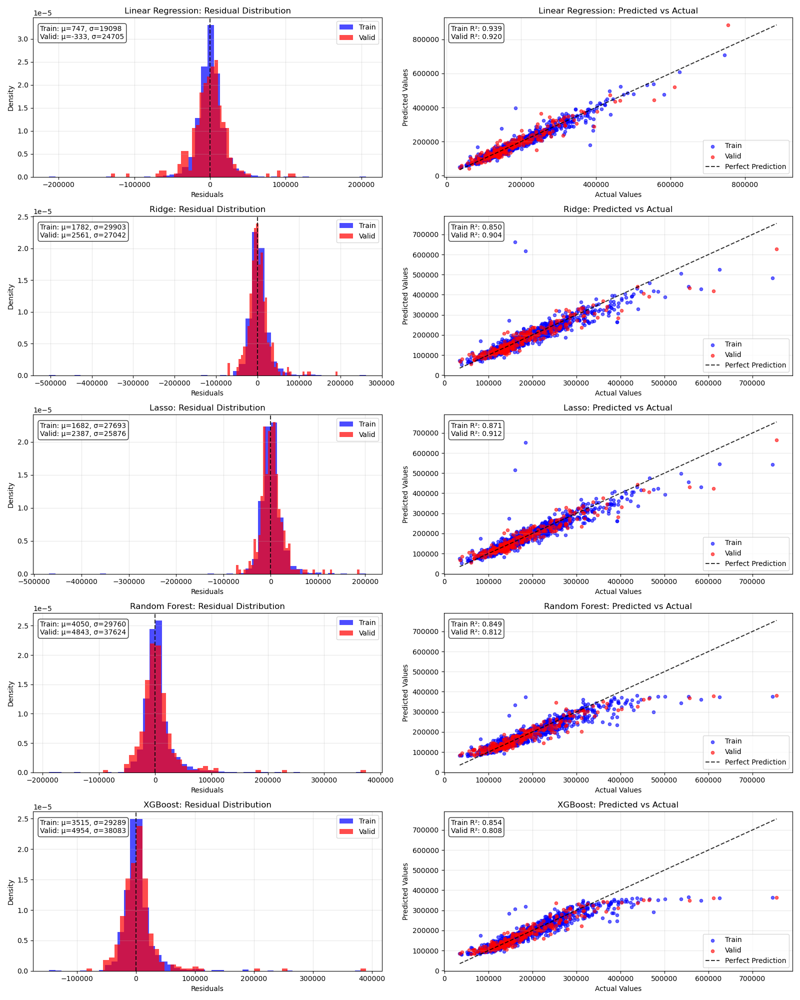
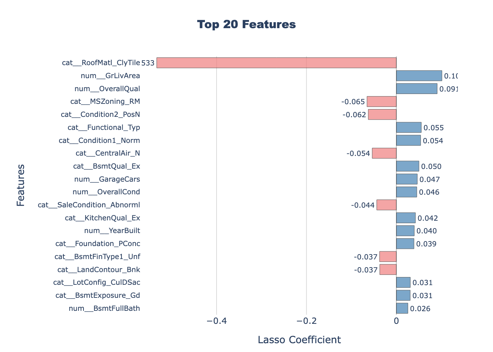
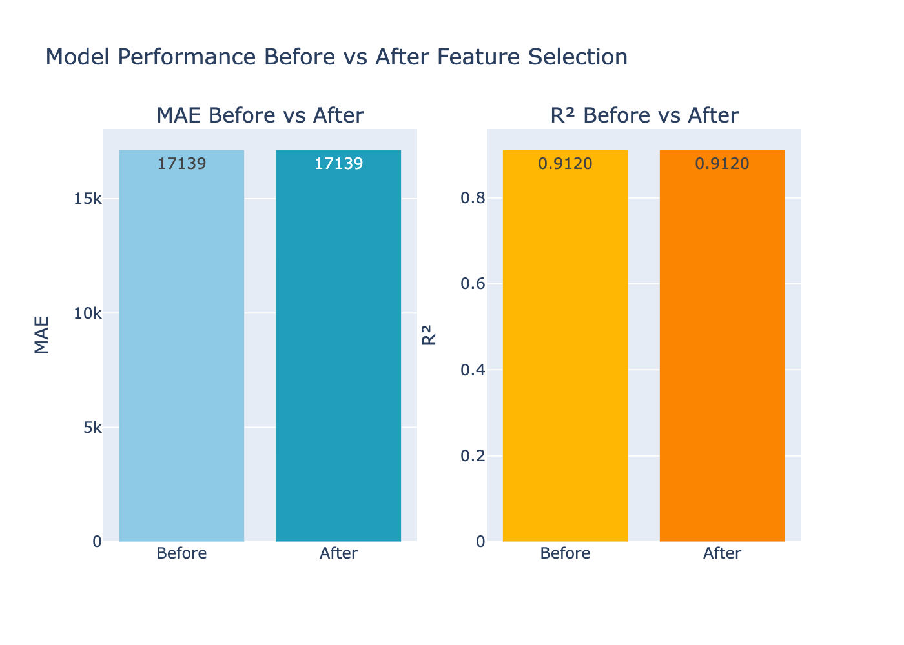

# 🏡 House Prices Prediction Project

## 📌 Overview

This project aims to predict house prices using the Ames Housing dataset. It includes comprehensive steps from **exploratory data analysis (EDA)** to **model selection** and **feature optimization**.

📂 Dataset Source:  
[Kaggle - House Prices: Advanced Regression Techniques](https://www.kaggle.com/competitions/home-data-for-ml-course)

The process is documented in two Jupyter Notebooks:

- [01_eda_insights.ipynb](notebooks/01_eda_insights.ipynb): EDA and feature understanding  
- [02_complete_modeling.ipynb](notebooks/02_complete_modeling.ipynb): Modeling, comparison, and final model refinement

---
## 🚀 Live Demo
🖥️ Explore the interactive dashboard and in-depth insights:
[🔗 Streamlit Live Demo](https://edwina1114-house-pricing-prediction-apphome-3qkfna.streamlit.app/)

The Streamlit app includes:

- 🎯 EDA summaries and visualizations

- 📈 Model performance comparisons

- 🧠 Feature selection insights

- 📊 Dynamic charts and metrics
  
---

## 🔍 Exploratory Data Analysis Highlights

Key insights from [01_eda_insights.ipynb](notebooks/01_eda_insights.ipynb):

- 🔄 **Target Transformation**: `SalePrice` was log-transformed to reduce right skew and improve model fit  
- 🧱 **Missing Value Handling**: Applied customized strategies based on feature semantics (e.g., quality vs presence)  
- 🧮 **Categorical Cardinality**: High-cardinality features (e.g., `Neighborhood`) were frequency-encoded; others used one-hot encoding  
- 📊 **Feature Correlation**: `OverallQual`, `GrLivArea`, and `GarageCars` showed strongest positive correlations with price  

> 📎 Visualizations available in [images/EDA/](images/EDA/) include:  
> - [Top Correlated Features](images/EDA/correlation_with_saleprice.png) 
> - [Categorical Features Cardinality](images/EDA/cardinality_of_categorical_features.png)
> - [Missing Value Box/Count Plots](images/EDA/box_count_missing_features.png)  
> - [Log-Transformed Target Distribution](images/EDA/target_distribution_log.png)

---

## 🧪 Modeling Pipeline

Key steps and insights from [02_complete_modeling.ipynb](notebooks/02_complete_modeling.ipynb):

- 🧹 **Data Preprocessing**
  - Built custom transformers based on EDA findings:
    - Ordinal + Binary Indicators for quality-related features (e.g., `PoolQC`, `FireplaceQu`)
    - Binary indicators for sparse categorical features (e.g., `Alley`, `Fence`)
    - Frequency encoding for high-cardinality features (`Neighborhood`, `Exterior1st`, `Exterior2nd`)
  - Combined all pipelines using `ColumnTransformer`

- 🧪 **Modeling & Evaluation**
  - Compared five models: `Linear`, `Ridge`, `Lasso`, `Random Forest`, and `XGBoost`
  - Evaluation metrics included:
    - **MAE** (Mean Absolute Error)
    - **R² Score**
    - **Overfitting Gap (%)** = Train R² − Valid R²

> 📊 Visual summary of model comparison:  
> 

---

### ✅ Final Model Selection: Lasso Regression

- Balanced performance: low MAE (~17,139), high R² (~0.912), and lowest overfitting gap (~12%)
- Built-in **feature selection** improved generalization and simplified model structure

> 📉 Residual & prediction comparison across models:  
> 

---

### 🔎 Feature Selection with Lasso

- Retained **76 out of 220 features (34.5%)** without loss in performance  
- Achieved a **2.9x compression ratio** while maintaining MAE and R²

> 🧠 Top 20 influential features from Lasso:  
> 

---

### 📈 Performance Before vs After Feature Selection

| Metric | Before | After |
|--------|--------|-------|
| MAE    | 17,139 | 17,139 |
| R²     | 0.9120 | 0.9120 |
| Retained Features | 220 | 76 |

> 📊 Comparison of model performance before and after feature selection:  
> 

---

## 🛠️ Tech Stack

- **Programming & Data Manipulation**: `Python`, `Pandas`, `NumPy`
- **Modeling & Evaluation**: `Scikit-learn` (`Pipeline`, `GridSearchCV`, `LassoCV`, `RidgeCV`, `SelectFromModel`, `TransformedTargetRegressor`), `XGBoost`
- **Visualization**: `Matplotlib`, `Seaborn`, `Plotly (express & graph_objects)`
- **Environment**: `Jupyter Notebook`


---

## 📁 File Structure
```
HOUSE_PRICING_PREDICTION/
├── app/                       # Streamlit app and supporting utils
│   ├── pages/                 # Streamlit tab pages
│   ├── utils/                 # Custom Functions
│   ├── data/                  # Intermediate CSVs for visualization
│   └── Home.py                # Main dashboard entry
├── data/ # Raw training and test datasets
│ ├── train.csv
│ └── test.csv
├── images/ # All result plots and visualizations
│ ├── EDA/ # Visualizations from exploratory analysis
│ └── Model/ # Model performance plots
├── notebooks/ 
│ ├── 01_eda_insights.ipynb # EDA and feature analysis
│ └── 02_complete_modeling.ipynb # Modeling and evaluation pipeline
└── README.md # Project overview and documentation
```

---

## 🚀 Streamlit - How to Run Locally

### ▶️ Option 1: Pip (recommended for Streamlit Cloud)
```bash
pip install -r requirements.txt
streamlit run app/Home.py
```

### ▶️ Option 2: With conda
```bash
conda env create -f environment.yml
conda activate streamlit_practice
streamlit run app/Home.py
```
